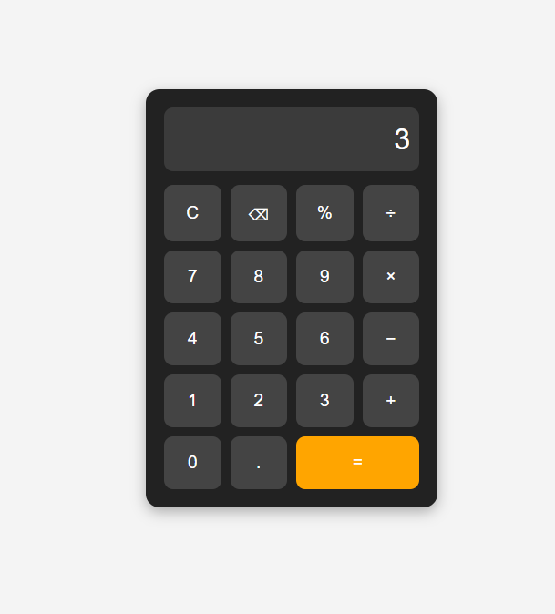

# Ex04 Simple Calculator - React Project
## Date:14-03-2026
## Name : Tawqir Ahamed Sayeed L
## Reg No : 212225240166

## AIM
To  develop a Simple Calculator using React.js with clean and responsive design, ensuring a smooth user experience across different screen sizes.

## ALGORITHM
### STEP 1
Create a React App.

### STEP 2
Open a terminal and run:
  <ul><li>npx create-react-app simple-calculator</li>
  <li>cd simple-calculator</li>
  <li>npm start</li></ul>

### STEP 3
Inside the src/ folder, create a new file Calculator.js and define the basic structure.

### STEP 4
Plan the UI: Display screen, number buttons (0-9), operators (+, -, *, /), clear (C), and equal (=).

### STEP 5
Create a new file Calculator.css in src/ and add the styling.

### STEP 6
Open src/App.js and modify it.

### STEP 7
Start the development server.
  npm start

### STEP 8
Open http://localhost:3000/ in the browser.

### STEP 9
Test the calculator by entering numbers and operations.

### STEP 10
Fix styling issues and refine content placement.

### STEP 11
Deploy the website.

### STEP 12
Upload to GitHub Pages for free hosting.

## PROGRAM
App.jsx
```
import { useState } from "react";
import "./App.css";

function App() {
  const [input, setInput] = useState("");

  const handleClick = (value) => {
    setInput(input + value);
  };

  const clearInput = () => {
    setInput("");
  };

  const deleteLast = () => {
    setInput(input.slice(0, -1));
  };

  const calculate = () => {
    try {
      setInput(eval(input).toString());
    } catch {
      setInput("Error");
    }
  };

  return (
    <div className="container">
      <div className="calculator">
        <input
          type="text"
          className="display"
          value={input}
          readOnly
        />

        <div className="buttons">
          <button onClick={clearInput}>C</button>
          <button onClick={deleteLast}>⌫</button>
          <button onClick={() => handleClick("%")}>%</button>
          <button onClick={() => handleClick("/")}>÷</button>

          <button onClick={() => handleClick("7")}>7</button>
          <button onClick={() => handleClick("8")}>8</button>
          <button onClick={() => handleClick("9")}>9</button>
          <button onClick={() => handleClick("*")}>×</button>

          <button onClick={() => handleClick("4")}>4</button>
          <button onClick={() => handleClick("5")}>5</button>
          <button onClick={() => handleClick("6")}>6</button>
          <button onClick={() => handleClick("-")}>−</button>

          <button onClick={() => handleClick("1")}>1</button>
          <button onClick={() => handleClick("2")}>2</button>
          <button onClick={() => handleClick("3")}>3</button>
          <button onClick={() => handleClick("+")}>+</button>

          <button onClick={() => handleClick("0")}>0</button>
          <button onClick={() => handleClick(".")}>.</button>
          <button className="equal" onClick={calculate}>
            =
          </button>
        </div>
      </div>
    </div>
  );
}

export default App;
```

App.css
```
* {
  margin: 0;
  padding: 0;
  box-sizing: border-box;
  font-family: Arial, sans-serif;
}

.container {
  min-height: 100vh;
  display: flex;
  justify-content: center;
  align-items: center;
  background: #f4f4f4;
}

.calculator {
  width: 320px;
  background: #222;
  padding: 20px;
  border-radius: 15px;
  box-shadow: 0px 5px 15px rgba(0,0,0,0.3);
}

.display {
  width: 100%;
  height: 70px;
  margin-bottom: 15px;
  padding: 10px;
  font-size: 2rem;
  text-align: right;
  border: none;
  border-radius: 10px;
}

.buttons {
  display: grid;
  grid-template-columns: repeat(4, 1fr);
  gap: 10px;
}

button {
  padding: 18px;
  border: none;
  border-radius: 10px;
  font-size: 1.2rem;
  cursor: pointer;
  background: #444;
  color: white;
  transition: 0.3s;
}

button:hover {
  background: #666;
}

.equal {
  grid-column: span 2;
  background: orange;
}

.equal:hover {
  background: darkorange;
}

@media (max-width: 480px) {
  .calculator {
    width: 90%;
  }
}


```


## OUTPUT



## RESULT
The program for developing a simple calculator in React.js is executed successfully.
